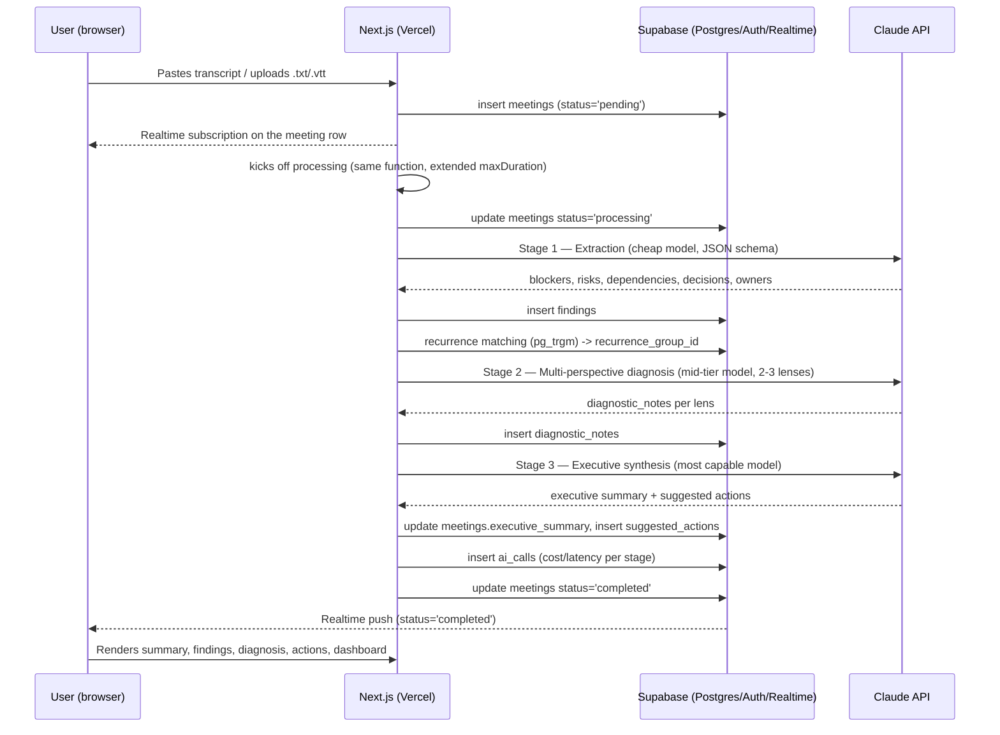

# Technical Architecture — ScopeLens

**Depends on:** PRD.md (scope and decisions closed in 8.3 and 10), CONTEXT.md
**Status:** data schema and end-to-end flow for the MVP (Phase 1). Gaps found in a pre-implementation spec review are tracked and resolved against this document in [GAPS.md](./GAPS.md).

---

## 1. Overview

Stack: Next.js on Vercel (frontend + API routes) → Supabase (Postgres + Auth + Realtime + Storage) → Claude API (Anthropic) for the AI pipeline → Stripe (billing, test mode) → Sentry (errors) + PostHog (analytics).

Design principle that runs through the rest of this document: **no new infrastructure component (queue, cache, separate vector database) is needed for the MVP.** Everything is handled with Postgres (RLS, `pg_trgm`, `pgvector` when needed) and Supabase Realtime. See PRD.md section 10 for the rationale behind each deferred area.

## 2. Data Schema

Every domain table carries `workspace_id` and has RLS enabled. Policies use a helper function instead of an inline subquery, so `workspaces`/`workspace_members` themselves can be protected without recursive-policy issues:

```sql
create function is_workspace_member(target_workspace_id uuid)
returns boolean
language sql security definer stable
as $$
  select exists (
    select 1 from workspace_members
    where workspace_id = target_workspace_id and user_id = auth.uid()
  );
$$;

create policy workspace_isolation on <table>
  using (is_workspace_member(workspace_id));

-- workspaces and workspace_members use the same function (on workspaces: is_workspace_member(id))
```

**Auth pattern for API routes (resolves GAPS.md G9):** Next.js API routes use the `@supabase/ssr` server client bound to the user's session cookie for anything that should respect RLS (reads, user-initiated writes). The AI pipeline's own writes (findings, diagnostic_notes, ai_calls) run under the service-role client — but only after the route has already verified, via the user-scoped client, that the caller belongs to the target `workspace_id`. The service role is never used to bypass a workspace check, only to avoid re-deriving one already done.

### 2.1 Multi-tenancy and auth

```
workspaces
  id                uuid pk
  name              text
  stripe_customer_id     text null
  stripe_subscription_id text null
  plan              text default 'free'   -- 'free' | 'pro'
  created_at        timestamptz default now()

workspace_members
  workspace_id      uuid fk -> workspaces on delete cascade
  user_id           uuid fk -> auth.users  (managed by Supabase Auth)
  role              text  -- 'owner' | 'admin' | 'member'
  created_at        timestamptz default now()
  primary key (workspace_id, user_id)

-- index: workspace_members(user_id) -- membership lookup direction used by is_workspace_member()
```

`auth.users` is Supabase Auth's native table — we don't recreate the user. An `on_auth_user_created` trigger automatically creates a `workspace` + `workspace_members(role='owner')` row on first signup (a common frictionless-onboarding pattern — addresses part of PRD risk #5, adoption friction).

**Scope decision (resolves GAPS.md G8):** there is deliberately no invite flow in the MVP — a workspace is single-owner (whoever signed up). Inviting teammates into an existing workspace is out of scope until post-MVP; it doesn't block any MVP feature (dashboard/recurrence/history all work fine for one user per workspace), but it does mean the "team workspace" framing in PRD.md section 4 should be read as aspirational until that flow exists.

### 2.2 Meetings

```
meetings
  id                uuid pk
  workspace_id      uuid fk -> workspaces on delete cascade
  title             text
  meeting_type      text        -- 'daily' | 'planning' | 'retro' | 'kickoff'
  source            text        -- 'paste' | 'upload'
  transcript_raw    text        -- max 50k chars, enforced at upload (resolves GAPS.md G17)
  occurred_at       timestamptz
  status            text default 'pending'   -- 'pending' | 'processing' | 'completed' | 'failed'
  error_message     text null
  executive_summary text null   -- output of the synthesis stage (8.3)
  created_by        uuid fk -> auth.users
  created_at        timestamptz default now()

-- index: meetings(workspace_id, occurred_at desc) -- history listing + Phase 6 trend query
```

`status` is the mechanism that replaces a job queue (see section 3). `transcript_raw` stores the pasted text or the content extracted from `.txt`/`.vtt`; there's no audio processing in the MVP (already a closed decision in the PRD).

**Storage decision (resolves GAPS.md G18):** the MVP does not use a Supabase Storage bucket. An uploaded `.txt`/`.vtt` is parsed at upload time (VTT cue timestamps stripped) and only the resulting text is kept, in `transcript_raw`. The original file is discarded — reintroduce Storage only if a later phase needs the raw file (e.g. audio in phase 2).

**Transcript length limit (resolves GAPS.md G17):** uploads/pastes over 50,000 characters are rejected client- and server-side with a clear error, instead of silently truncating or blowing up token cost. This is a placeholder ceiling, not a tuned one — revisit once real transcripts are seen.

### 2.3 Findings (blockers, risks, dependencies, decisions)

The four categories from PRD section 8.1 #2 share the same shape (description, owner, status, recurrence tracking) — a single typed table avoids four near-duplicate tables:

```
findings
  id                  uuid pk
  workspace_id        uuid fk -> workspaces on delete cascade
  meeting_id          uuid fk -> meetings on delete cascade
  finding_type        text    -- 'blocker' | 'risk' | 'dependency' | 'decision'
  description         text
  owner               text null            -- owner mentioned in the meeting, free text (not a system-user FK)
  decision_status      text null            -- only for finding_type='decision': 'taken' | 'pending'
  status              text default 'open'   -- 'open' | 'resolved'
  recurrence_group_id uuid not null fk -> findings(id)  -- always set: the root/canonical occurrence's own id points to itself
  embedding           vector(1536) null     -- pgvector extension enabled from the start (see 2.6); column unused until a matching strategy needs it
  created_at          timestamptz default now()
  updated_at          timestamptz default now()
  resolved_at         timestamptz null      -- set when status transitions to 'resolved'; required for the Phase 6 trend query (resolves GAPS.md G6)

-- index: findings(workspace_id, finding_type, status) -- recurrence matching scope
-- index: findings using gin (description gin_trgm_ops) -- pg_trgm similarity search
-- index: findings(recurrence_group_id)
```

**Recurrence (PRD feature 7):** when extracting findings from a new meeting, the matching step looks for open findings in the same workspace with the same `finding_type` and a similar description (`similarity(description, $new) > threshold` via `pg_trgm`). If a match is found, the new record inherits the matched finding's `recurrence_group_id`. If no match is found, the new record is its own root: `recurrence_group_id = id`. `recurrence_group_id` is therefore never null — every downstream aggregation (trend dashboard, occurrence counts) groups by it directly, no `COALESCE` needed (resolves GAPS.md G5).

**Reopened findings:** if a finding was `resolved` and the same issue resurfaces in a later meeting, matching only scans `open` findings by design, so the new occurrence starts a **new** `recurrence_group_id` rather than reopening the old chain — a resolved risk resurfacing is itself a signal worth surfacing distinctly, not silently merged into history. Revisit if this produces noisy duplicate chains in practice.

**"Over time" scope (resolves GAPS.md G7):** the MVP has no `sprints` entity. The Phase 6 trend dashboard groups by calendar time (`meetings.occurred_at`), not by sprint — PRD/Roadmap wording of "across sprints" should be read as "over time." A `sprints` table is a clean post-MVP addition if needed later, not a schema change to `findings`.

### 2.4 Diagnosis and suggestions

```
diagnostic_notes
  id            uuid pk
  workspace_id  uuid fk -> workspaces on delete cascade
  meeting_id    uuid fk -> meetings on delete cascade
  lens          text    -- 'contradiction' | 'continuity' | 'decision_gap'  -- closed list, see section 4 (resolves GAPS.md G14)
  content       text
  related_finding_ids uuid[] null   -- not FK-enforceable (array), best-effort reference only
  created_at    timestamptz default now()

suggested_actions
  id            uuid pk
  workspace_id  uuid fk -> workspaces on delete cascade
  meeting_id    uuid fk -> meetings on delete cascade
  description   text
  priority      text default 'medium'   -- 'low' | 'medium' | 'high'
  status        text default 'open'     -- 'open' | 'done' | 'dismissed'
  created_at    timestamptz default now()

-- index: diagnostic_notes(meeting_id), suggested_actions(meeting_id)
```

### 2.5 AI cost (the pipeline's own observability)

Given that cost per call is an explicit product principle (PRD section 6/9), it's worth logging every call instead of relying solely on the provider's dashboard:

```
ai_calls
  id            uuid pk
  workspace_id  uuid fk -> workspaces on delete cascade
  meeting_id    uuid fk -> meetings on delete cascade
  stage         text   -- 'extraction' | 'diagnostic' | 'synthesis'
  model         text
  tokens_in     int
  tokens_out    int
  cost_usd      numeric null   -- computed from tokens * model pricing at call time
  latency_ms    int
  created_at    timestamptz default now()

-- index: ai_calls(workspace_id, created_at)  -- monthly cost-ceiling lookup
```

This also becomes direct portfolio material (PRD section 11 asks for "architecture decisions documented and defensible in an interview" — having real per-stage cost data is concrete proof of the model-tiering decision).

**Cost ceiling enforcement (resolves GAPS.md G12):** before Stage 1 runs, the pipeline sums `cost_usd` from `ai_calls` for the workspace over the current calendar month. If that sum is at or above a configurable ceiling (env var, initial value US$5/workspace/month — well above the PRD 11.1 reference of $0.10/meeting, enough headroom for ~50 analyses), the request is rejected with a clear "monthly AI budget reached" error instead of silently proceeding. This is a blunt guardrail against runaway cost (PRD risk #4), not a billing feature — the real per-plan gate is Phase 7.

### 2.6 Required Postgres extensions

- `pg_trgm` — text-similarity matching for recurrence (enabled from the start of the MVP).
- `pgvector` — **enabled from the start of the MVP** (resolves GAPS.md G1 — a `vector` column cannot exist without the extension, so declaring it in 2.3 while deferring the extension was inconsistent). The `embedding` column stays nullable and unpopulated until/unless `pg_trgm` matching proves insufficient; enabling the extension up front costs nothing and avoids a migration surprise later.

## 3. End-to-End Flow



Design points worth calling out:

- **No queue/Redis:** processing runs in the same function that received the upload (Vercel Fluid Compute / extended `maxDuration` covers the ~3 chained calls for a single meeting). If volume grows enough to justify a real async queue, that's an isolated change to the processing function — it doesn't touch the schema or the frontend, because the contract is already "status on the table + Realtime." **Open risk (GAPS.md G15):** the actual `maxDuration` ceiling of the Vercel plan in use hasn't been verified against a ~30-45min transcript's 3 chained calls — needs checking once the account exists (TODO Phase 0 #5). Fallback if it doesn't fit: split into one route per stage, each re-triggering the next via a fetch call — still no queue, just more hops.
- **No manual polling:** the frontend doesn't keep asking "is it done yet?" — it subscribes to the row via Supabase Realtime and reacts to the `status` change.
- **RLS on every read:** the dashboard (feature 8) and history (feature 6) are just aggregate queries over `findings`/`meetings` filtered by RLS — no tenant-isolation logic lives in the application.
- **Retry and partial failure (resolves GAPS.md G13):** each stage's DB writes commit only on that stage's success. If a stage fails (API error, timeout, schema-validation failure on the model's output), the pipeline stops, sets `meetings.status='failed'` and `error_message`, and does **not** leave partial data from that stage. A user-triggered retry re-runs the full pipeline from Stage 1 after deleting any `findings`/`diagnostic_notes`/`suggested_actions` already attached to that `meeting_id` — simplest correct behavior for MVP volume, avoids reasoning about resuming mid-pipeline. Each individual Claude API call gets up to 2 retries with backoff before the stage is considered failed.
- **Billing:** Stripe Checkout (test mode) → webhook in an API route → updates `workspaces.plan`/`stripe_subscription_id`. A feature gate (e.g. a meetings/month limit on the free plan) is checked in the API route before accepting a new `insert` into `meetings`, reflecting the `plan` field. **Webhook security (resolves GAPS.md G20, implemented in Phase 7):** the handler must verify the Stripe signature (`stripe.webhooks.constructEvent`) and dedupe by `event.id` before applying it — no processing of unverified or replayed events.

## 4. AI Pipeline Contracts (resolves GAPS.md G10/G11/G14)

Model tiering — placeholder IDs, revisit once real cost/quality data exists from Phase 3:

| Stage | Model | Purpose |
|---|---|---|
| 1. Extraction | `claude-haiku-4-5` | cheap/fast structured extraction |
| 2. Diagnosis | `claude-sonnet-5` | multi-perspective reasoning, still cost-controlled |
| 3. Synthesis | `claude-opus-5` | highest-quality output, what the user reads |

Stage 1 — Extraction, structured output (Claude tool-use forced to a JSON schema), one call per meeting:
```
input:  { transcript: string, meeting_type: string }
output: {
  blockers:     [{ description: string, owner: string | null }],
  risks:        [{ description: string, owner: string | null }],
  dependencies: [{ description: string, owner: string | null }],
  decisions:    [{ description: string, decision_status: 'taken' | 'pending', owner: string | null }]
}
```

Stage 2 — Multi-perspective diagnosis, one call, structured output per lens. The three lenses are closed for the MVP (no longer "e.g."):
- `contradiction` — participants describing the same thing incompatibly, implying undisclosed risk.
- `continuity` — cross-references prior meetings in the same workspace (via findings history), flags patterns not visible from this meeting alone.
- `decision_gap` — decisions that should have been made but weren't, blocking downstream work.
```
input:  { transcript: string, findings: <Stage 1 output>, prior_findings: Finding[] }
output: {
  notes: [{ lens: 'contradiction' | 'continuity' | 'decision_gap', content: string, related_finding_ids: string[] }]
}
```

Stage 3 — Executive synthesis, one call:
```
input:  { transcript_summary: string, findings: <Stage 1 output>, diagnostic_notes: <Stage 2 output> }
output: {
  executive_summary: string,
  suggested_actions: [{ description: string, priority: 'low' | 'medium' | 'high' }]
}
```

## 5. Data Retention (resolves GAPS.md G19)

No automatic time-based retention in the MVP — meeting data lives until explicitly deleted. Deleting a meeting cascades to its `findings`/`diagnostic_notes`/`suggested_actions`/`ai_calls` (via `on delete cascade`, section 2); deleting a workspace cascades everything in it. This is a deliberate minimal starting point given PRD section 9's sensitivity concern — revisit (e.g. auto-purge after N days) only if the product gets real, non-portfolio users.

## 6. Not Covered in This Document (belongs to the roadmap)

- Implementation phase sequencing.
- Exact prompts for each stage of the AI pipeline (the contracts in section 4 define shape, not wording).
- Measurable technical success criteria (closed in PRD.md section 11.1).
