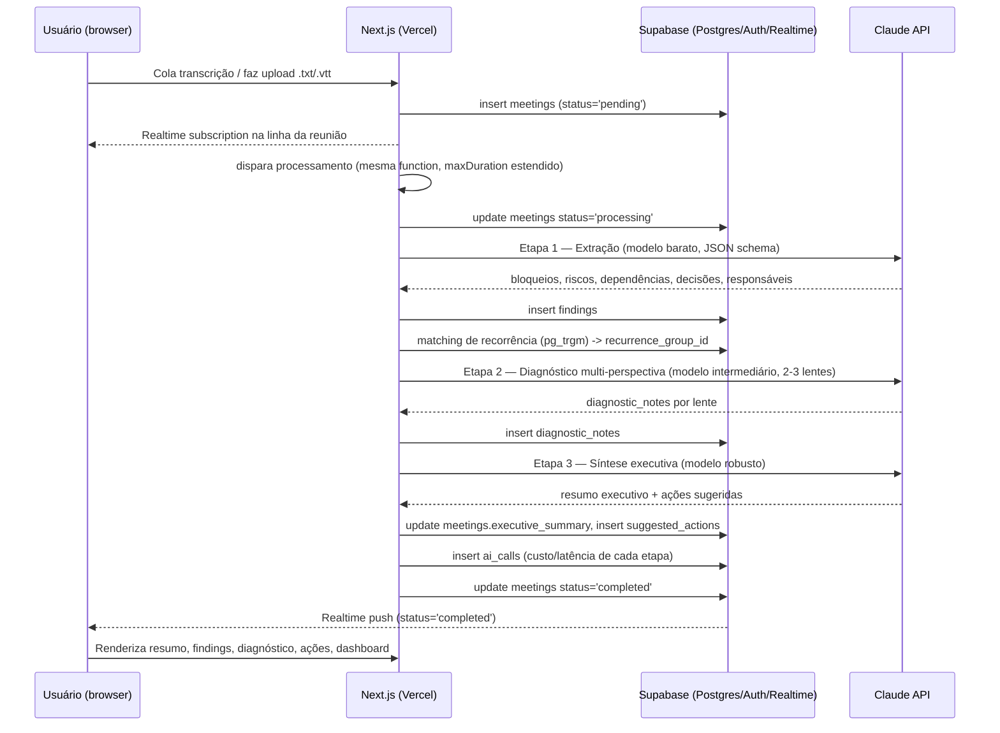

# Arquitetura Técnica — ScopeLens

**Depende de:** PRD.md (escopo e decisões fechadas em 8.3 e 10), CONTEXT.md
**Status:** schema de dados e fluxo ponta a ponta para o MVP (Fase 1)

---

## 1. Visão geral

Stack: Next.js no Vercel (frontend + API routes) → Supabase (Postgres + Auth + Realtime + Storage) → Claude API (Anthropic) pro pipeline de IA → Stripe (billing, test mode) → Sentry (erro) + PostHog (analytics).

Princípio de design que atravessa todo o resto deste documento: **nenhum componente novo de infraestrutura (fila, cache, banco vetorial separado) é necessário pro MVP.** Tudo é resolvido com Postgres (RLS, `pg_trgm`, `pgvector` quando necessário) e Supabase Realtime. Ver PRD.md seção 10 para a justificativa de cada área adiada.

## 2. Schema de dados

Todas as tabelas de domínio carregam `workspace_id` e têm RLS habilitado. Política padrão:

```sql
create policy workspace_isolation on <tabela>
  using (workspace_id in (
    select workspace_id from workspace_members where user_id = auth.uid()
  ));
```

### 2.1 Multi-tenancy e auth

```
workspaces
  id                uuid pk
  name              text
  stripe_customer_id     text null
  stripe_subscription_id text null
  plan              text default 'free'   -- 'free' | 'pro'
  created_at        timestamptz default now()

workspace_members
  workspace_id      uuid fk -> workspaces
  user_id           uuid fk -> auth.users  (gerenciado pelo Supabase Auth)
  role              text  -- 'owner' | 'admin' | 'member'
  created_at        timestamptz default now()
  primary key (workspace_id, user_id)
```

`auth.users` é a tabela nativa do Supabase Auth — não recriamos usuário. Um trigger `on_auth_user_created` cria automaticamente um `workspace` + `workspace_members(role='owner')` no primeiro signup (padrão comum de onboarding sem fricção — resolve parte do risco #5 do PRD, fricção de adoção).

### 2.2 Reuniões

```
meetings
  id                uuid pk
  workspace_id      uuid fk -> workspaces
  title             text
  meeting_type      text        -- 'daily' | 'planning' | 'retro' | 'kickoff'
  source            text        -- 'paste' | 'upload'
  transcript_raw    text
  occurred_at       timestamptz
  status            text default 'pending'   -- 'pending' | 'processing' | 'completed' | 'failed'
  error_message     text null
  executive_summary text null   -- output da etapa de síntese (8.3)
  created_by        uuid fk -> auth.users
  created_at        timestamptz default now()
```

`status` é o mecanismo que substitui uma fila de jobs (ver seção 3). `transcript_raw` guarda o texto colado ou extraído do `.txt`/`.vtt`; não há processamento de áudio no MVP (decisão já fechada no PRD).

### 2.3 Findings (bloqueios, riscos, dependências, decisões)

As quatro categorias da seção 8.1 #2 do PRD compartilham a mesma forma (descrição, responsável, status, rastreamento de recorrência) — uma única tabela tipada evita quatro tabelas quase-duplicadas:

```
findings
  id                  uuid pk
  workspace_id        uuid fk -> workspaces
  meeting_id          uuid fk -> meetings
  finding_type        text    -- 'blocker' | 'risk' | 'dependency' | 'decision'
  description         text
  owner               text null            -- responsável citado na reunião, texto livre (não é FK de usuário do sistema)
  decision_status      text null            -- só p/ finding_type='decision': 'taken' | 'pending'
  status              text default 'open'   -- 'open' | 'resolved'
  recurrence_group_id uuid null fk -> findings(id)  -- aponta pra ocorrência "canônica" da mesma issue em reuniões anteriores; null = primeira ocorrência
  embedding           vector(1536) null     -- populado só se/quando pgvector for ligado (ver 2.5); null no MVP inicial
  created_at          timestamptz default now()
```

**Recorrência (feature 7 do PRD):** ao extrair findings de uma nova reunião, a etapa de matching busca findings abertos do mesmo workspace com `finding_type` igual e descrição parecida (`similarity(description, $novo) > threshold` via `pg_trgm`). Se encontrar, o novo registro herda o `recurrence_group_id` do mais antigo da cadeia (ou usa o próprio id do achado original, se for a 2ª ocorrência). O dashboard de tendência (feature 8) agrupa por `recurrence_group_id` e conta ocorrências.

### 2.4 Diagnóstico e sugestões

```
diagnostic_notes
  id            uuid pk
  workspace_id  uuid fk -> workspaces
  meeting_id    uuid fk -> meetings
  lens          text    -- ex.: 'contradiction' | 'continuity' | 'decision_gap'
  content       text
  related_finding_ids uuid[] null
  created_at    timestamptz default now()

suggested_actions
  id            uuid pk
  workspace_id  uuid fk -> workspaces
  meeting_id    uuid fk -> meetings
  description   text
  priority      text default 'medium'   -- 'low' | 'medium' | 'high'
  status        text default 'open'     -- 'open' | 'done' | 'dismissed'
  created_at    timestamptz default now()
```

### 2.5 Custo de IA (observabilidade do próprio pipeline)

Dado que custo por chamada é princípio explícito do produto (PRD seção 6/9), vale logar cada chamada, não só confiar no dashboard do provedor:

```
ai_calls
  id            uuid pk
  meeting_id    uuid fk -> meetings
  stage         text   -- 'extraction' | 'diagnostic' | 'synthesis'
  model         text
  tokens_in     int
  tokens_out    int
  latency_ms    int
  created_at    timestamptz default now()
```

Isso também vira material de portfólio direto (seção 11 do PRD pede "decisões de arquitetura documentadas e justificáveis em entrevista" — ter dado real de custo por etapa é prova concreta do tiering de modelo).

### 2.6 Extensões Postgres necessárias

- `pg_trgm` — matching de recorrência por similaridade de texto (ligado desde o início do MVP).
- `pgvector` — **não ligado no MVP inicial.** Fica pronto pra ligar (coluna `embedding` já existe, nullable) se o matching por `pg_trgm` se mostrar insuficiente. Não exige migração de tabela, só popular a coluna e trocar a query de matching.

## 3. Fluxo ponta a ponta



Pontos de desenho que valem registrar:

- **Sem fila/Redis:** o processamento roda na própria function que recebeu o upload (Vercel Fluid Compute / `maxDuration` estendido cobre os ~3 calls encadeados de uma única reunião). Se o volume crescer a ponto de justificar fila assíncrona de verdade, isso é uma mudança isolada na function de processamento — não afeta schema nem frontend, porque o contrato já é "status na tabela + Realtime".
- **Sem polling manual:** o frontend não fica perguntando "terminou?" — assina a linha via Supabase Realtime e reage à mudança de `status`.
- **RLS em toda leitura:** o dashboard (feature 8) e o histórico (feature 6) são só queries agregadas sobre `findings`/`meetings` filtradas por RLS — nenhuma lógica de isolamento de tenant vive na aplicação.
- **Billing:** Stripe Checkout (test mode) → webhook em API route → atualiza `workspaces.plan`/`stripe_subscription_id`. Gate de feature (ex.: limite de reuniões/mês no free) é checado na API route antes de aceitar novo `insert` em `meetings`, refletindo o campo `plan`.

## 4. O que este documento não cobre (fica pro roadmap)

- Sequenciamento de fases de implementação.
- Prompts exatos de cada etapa do pipeline de IA.
- Critério de sucesso técnico mensurável (item 5 pendente na seção 12 do PRD).
