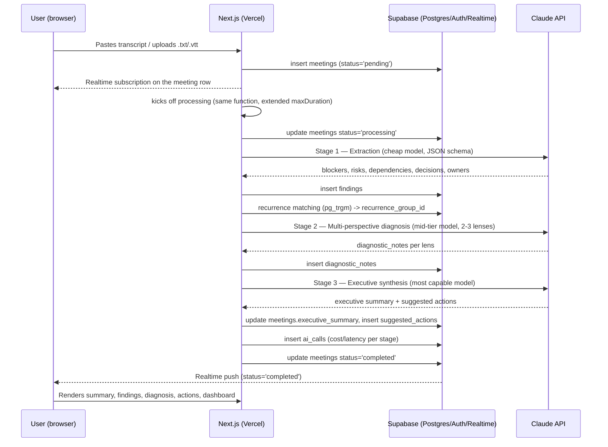

# Technical Architecture — ScopeLens

**Depends on:** PRD.md (scope and decisions closed in 8.3 and 10), CONTEXT.md
**Status:** data schema and end-to-end flow for the MVP (Phase 1)

---

## 1. Overview

Stack: Next.js on Vercel (frontend + API routes) → Supabase (Postgres + Auth + Realtime + Storage) → Claude API (Anthropic) for the AI pipeline → Stripe (billing, test mode) → Sentry (errors) + PostHog (analytics).

Design principle that runs through the rest of this document: **no new infrastructure component (queue, cache, separate vector database) is needed for the MVP.** Everything is handled with Postgres (RLS, `pg_trgm`, `pgvector` when needed) and Supabase Realtime. See PRD.md section 10 for the rationale behind each deferred area.

## 2. Data Schema

Every domain table carries `workspace_id` and has RLS enabled. Default policy:

```sql
create policy workspace_isolation on <table>
  using (workspace_id in (
    select workspace_id from workspace_members where user_id = auth.uid()
  ));
```

### 2.1 Multi-tenancy and auth

```
workspaces
  id                uuid pk
  name              text
  stripe_customer_id     text null
  stripe_subscription_id text null
  plan              text default 'free'   -- 'free' | 'pro'
  created_at        timestamptz default now()

workspace_members
  workspace_id      uuid fk -> workspaces
  user_id           uuid fk -> auth.users  (managed by Supabase Auth)
  role              text  -- 'owner' | 'admin' | 'member'
  created_at        timestamptz default now()
  primary key (workspace_id, user_id)
```

`auth.users` is Supabase Auth's native table — we don't recreate the user. An `on_auth_user_created` trigger automatically creates a `workspace` + `workspace_members(role='owner')` row on first signup (a common frictionless-onboarding pattern — addresses part of PRD risk #5, adoption friction).

### 2.2 Meetings

```
meetings
  id                uuid pk
  workspace_id      uuid fk -> workspaces
  title             text
  meeting_type      text        -- 'daily' | 'planning' | 'retro' | 'kickoff'
  source            text        -- 'paste' | 'upload'
  transcript_raw    text
  occurred_at       timestamptz
  status            text default 'pending'   -- 'pending' | 'processing' | 'completed' | 'failed'
  error_message     text null
  executive_summary text null   -- output of the synthesis stage (8.3)
  created_by        uuid fk -> auth.users
  created_at        timestamptz default now()
```

`status` is the mechanism that replaces a job queue (see section 3). `transcript_raw` stores the pasted text or the content extracted from `.txt`/`.vtt`; there's no audio processing in the MVP (already a closed decision in the PRD).

### 2.3 Findings (blockers, risks, dependencies, decisions)

The four categories from PRD section 8.1 #2 share the same shape (description, owner, status, recurrence tracking) — a single typed table avoids four near-duplicate tables:

```
findings
  id                  uuid pk
  workspace_id        uuid fk -> workspaces
  meeting_id          uuid fk -> meetings
  finding_type        text    -- 'blocker' | 'risk' | 'dependency' | 'decision'
  description         text
  owner               text null            -- owner mentioned in the meeting, free text (not a system-user FK)
  decision_status      text null            -- only for finding_type='decision': 'taken' | 'pending'
  status              text default 'open'   -- 'open' | 'resolved'
  recurrence_group_id uuid null fk -> findings(id)  -- points to the "canonical" occurrence of the same issue in earlier meetings; null = first occurrence
  embedding           vector(1536) null     -- populated only if/when pgvector is turned on (see 2.5); null initially
  created_at          timestamptz default now()
```

**Recurrence (PRD feature 7):** when extracting findings from a new meeting, the matching step looks for open findings in the same workspace with the same `finding_type` and a similar description (`similarity(description, $new) > threshold` via `pg_trgm`). If a match is found, the new record inherits the `recurrence_group_id` from the oldest one in the chain (or uses the original finding's own id, if it's the 2nd occurrence). The trend dashboard (feature 8) groups by `recurrence_group_id` and counts occurrences.

### 2.4 Diagnosis and suggestions

```
diagnostic_notes
  id            uuid pk
  workspace_id  uuid fk -> workspaces
  meeting_id    uuid fk -> meetings
  lens          text    -- e.g. 'contradiction' | 'continuity' | 'decision_gap'
  content       text
  related_finding_ids uuid[] null
  created_at    timestamptz default now()

suggested_actions
  id            uuid pk
  workspace_id  uuid fk -> workspaces
  meeting_id    uuid fk -> meetings
  description   text
  priority      text default 'medium'   -- 'low' | 'medium' | 'high'
  status        text default 'open'     -- 'open' | 'done' | 'dismissed'
  created_at    timestamptz default now()
```

### 2.5 AI cost (the pipeline's own observability)

Given that cost per call is an explicit product principle (PRD section 6/9), it's worth logging every call instead of relying solely on the provider's dashboard:

```
ai_calls
  id            uuid pk
  meeting_id    uuid fk -> meetings
  stage         text   -- 'extraction' | 'diagnostic' | 'synthesis'
  model         text
  tokens_in     int
  tokens_out    int
  latency_ms    int
  created_at    timestamptz default now()
```

This also becomes direct portfolio material (PRD section 11 asks for "architecture decisions documented and defensible in an interview" — having real per-stage cost data is concrete proof of the model-tiering decision).

### 2.6 Required Postgres extensions

- `pg_trgm` — text-similarity matching for recurrence (enabled from the start of the MVP).
- `pgvector` — **not enabled in the initial MVP.** Ready to enable (the `embedding` column already exists, nullable) if `pg_trgm` matching proves insufficient. Requires no table migration, just populating the column and swapping the matching query.

## 3. End-to-End Flow



Design points worth calling out:

- **No queue/Redis:** processing runs in the same function that received the upload (Vercel Fluid Compute / extended `maxDuration` covers the ~3 chained calls for a single meeting). If volume grows enough to justify a real async queue, that's an isolated change to the processing function — it doesn't touch the schema or the frontend, because the contract is already "status on the table + Realtime."
- **No manual polling:** the frontend doesn't keep asking "is it done yet?" — it subscribes to the row via Supabase Realtime and reacts to the `status` change.
- **RLS on every read:** the dashboard (feature 8) and history (feature 6) are just aggregate queries over `findings`/`meetings` filtered by RLS — no tenant-isolation logic lives in the application.
- **Billing:** Stripe Checkout (test mode) → webhook in an API route → updates `workspaces.plan`/`stripe_subscription_id`. A feature gate (e.g. a meetings/month limit on the free plan) is checked in the API route before accepting a new `insert` into `meetings`, reflecting the `plan` field.

## 4. Not Covered in This Document (belongs to the roadmap)

- Implementation phase sequencing.
- Exact prompts for each stage of the AI pipeline.
- Measurable technical success criteria (closed in PRD.md section 11.1).
